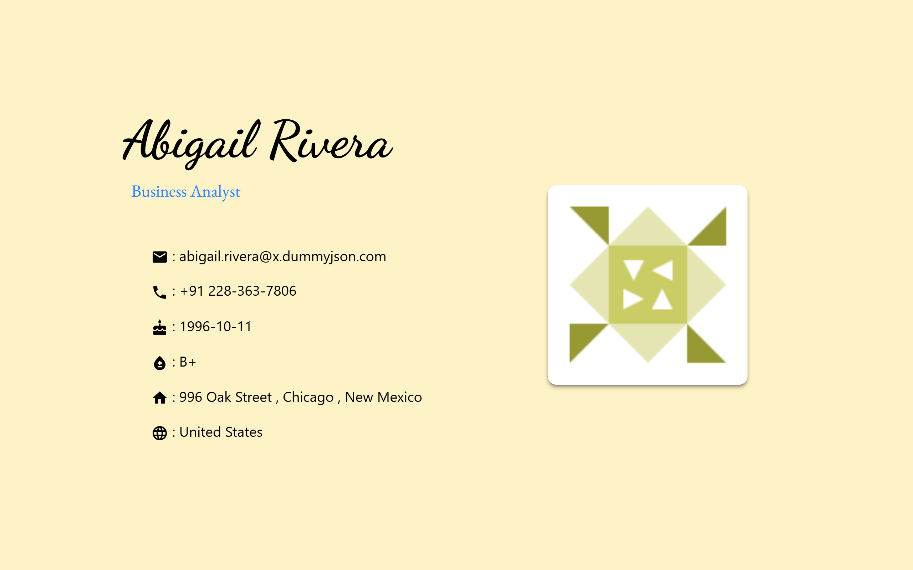

# Carousel Project

A modern and responsive **Carousel UI project** built with **React**, **Vite**, and **Tailwind CSS**, featuring smooth sliding animations using **react-slick** and UI components from **Material UI**.

## 🚀 Tech Stack

* **React 19**
* **Vite**
* **Tailwind CSS**
* **Material UI (MUI)**
* **react-slick & slick-carousel**
* **Axios**
* **ESLint**

## ✨ Features

* Responsive image carousel
* Smooth sliding animations
* Reusable React components
* Modern UI styling with Tailwind CSS & MUI
* Fast development and build using Vite

## 📁 Project Structure

```
carousel/
├── public/
├── src/
│   ├── assets/
│   ├── components/
│   │   ├── Banner.jsx
│   │   ├── ImgCard.jsx
│   │   └── InfoCard.jsx
│   ├── App.jsx
│   ├── main.jsx
│   └── index.css
├── index.html
├── package.json
└── vite.config.js
```

## 🛠️ Installation & Setup

1. **Clone the repository**

   ```bash
   git clone <your-repo-url>
   ```

2. **Navigate to the project folder**

   ```bash
   cd carousel
   ```

3. **Install dependencies**

   ```bash
   npm install
   ```

4. **Start the development server**

   ```bash
   npm run dev
   ```

5. Open your browser and go to:

   ```
   http://localhost:5173
   ```

## 📦 Available Scripts

* `npm run dev` – Start development server
* `npm run build` – Build for production
* `npm run preview` – Preview production build
* `npm run lint` – Run ESLint

## 🖼️ Carousel Library

This project uses **react-slick** for carousel functionality.

Make sure these styles are included (already handled via dependencies):

```bash
slick-carousel
```

## 🖼️ Screenshots

### Large Monitor


### Laptop


### Small Laptop


### Tablet


### Smartphone


### Live Preview

[live@]()


## 📄 License

This project is for learning and personal use.

---
